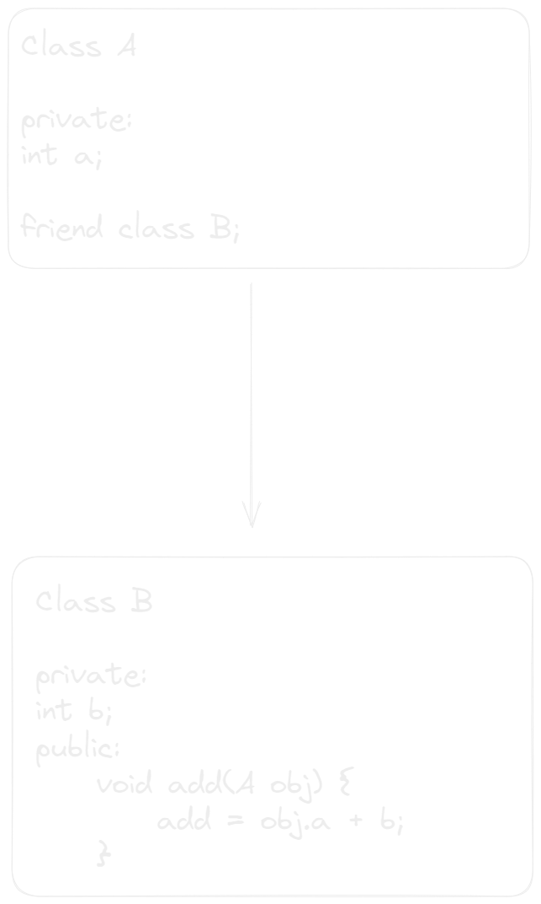

### March 1

## Friend Function 

A friend function is a function that can access the non-public members of a class even though function itself not a member of the class.

A Friend function is a normal function with special access previlages 

### Advantage of using friend function
* It enhances the efficiency of the program
* It can access non-public members of a class 
* It helps to add additional functionality that is not used by class generally

## Friend Class
A friend class is a class which can excess private or protected members of other class in which it is declared as friend

```cpp
class class_Name {
    friend return_type function name(argument) {
        
    }
}
```


#### Example

```cpp

```
