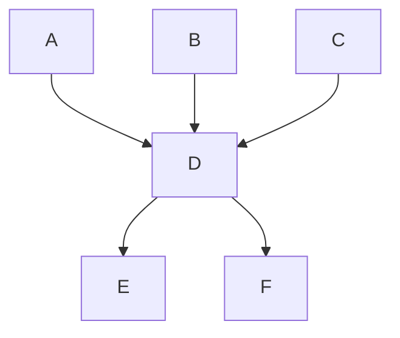

### Feb 12

### Inheritance 

#### 1. Single Inherirance 

> Syntax
```cpp
Class A {
    //Statements
}

Class B: public A {
    //Statements
}
```


#### 2. Multiple Inheritance 

> Syntax

```cpp
Class A {
    //Statements
    //Functions or Data Members
}

Class B {
    //Statements
    //Functions or data members 
}

Class C : public A,B {
    //Statements 
}
```

#### 3. Multilevel
> Syntax

```cpp
Class A {
    //Statements
    //Functions or Data Members
}

Class B: public A {
    //Statements
    //Functions or data members 
}

Class C : public B {
    //Statements 
}
```

#### 4. Hierarchical

```cpp
Class A {
    //Statements
    //Functions or Data Members
}

Class B: public A {
    //Statements
    //Functions or data members 
}

Class C : public A {
    //Statements 
}

Class D: public B {
    //Statements
}

Class E: public B {
    //Statements
}

Class F: public C {
    //Statements
}
```



#### 5. Hybrid

```cpp
Class A {
    //Statements
    //Functions or Data Members
}

Class B {
    //Statements
    //Functions or data members 
}

Class C {
    //Statements 
}

Class D: public A,B,C {
    //Statements
}

Class E: public D {
    //Statements
}

Class F: public D {
    //Statements
}
```

#### Example of Multilevel inheritance

```cpp
#include <iostream>
using namespace std;

class firstClass {
    public:
        int numOne;
};

class secondClass {
    public:
        int numTwo;
};

class thirdClass {
    public:
        int numThree;
};

class mainClass: public firstClass, public secondClass, public  thirdClass {
    public:
        int numFour;
        
        void mainFunction() {
            cout << numOne << " " << numTwo << " " << numThree << " " << numFour << endl;
        }
};

int main() {
    mainClass mtn;

    mtn.numOne = 10;
    mtn.numTwo = 20;
    mtn.numThree = 30;
    mtn.numFour = 40;

    mtn.mainFunction();

    return 0;
}
```


