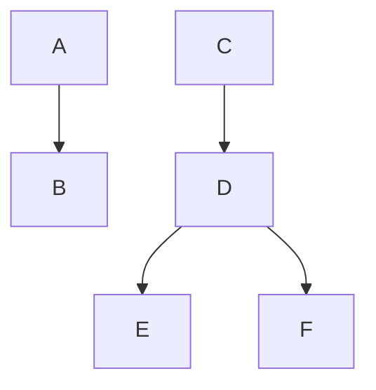

### Feb 17

## Hierarchical Inheritance

### 1. Write a program to find the sum and product of two numbers using hierarchical inheritance

```cpp
#include <iostream>
using namespace std;

class Num {
    public:
        int x, y;

        void getData() {
            cout << "Enter x: ";
            cin >> x;
            cout << "Enter y: ";
            cin >> y;
        }
};

class Sum: public Num {
    public:
        void add() {
                cout << "The sum = " << (x + y) << endl;
        }
};

class Product: public Num {
    public:
        void product() {
                cout << "The product = " << (x * y);
        }
};

int main() {
    Sum s;
    Product p;

    s.getData();
    s.add();
    p.getData();

    return 0;
}
```

## Hybrid Inheritance

> Example of hybrid inheritance



```cpp

```